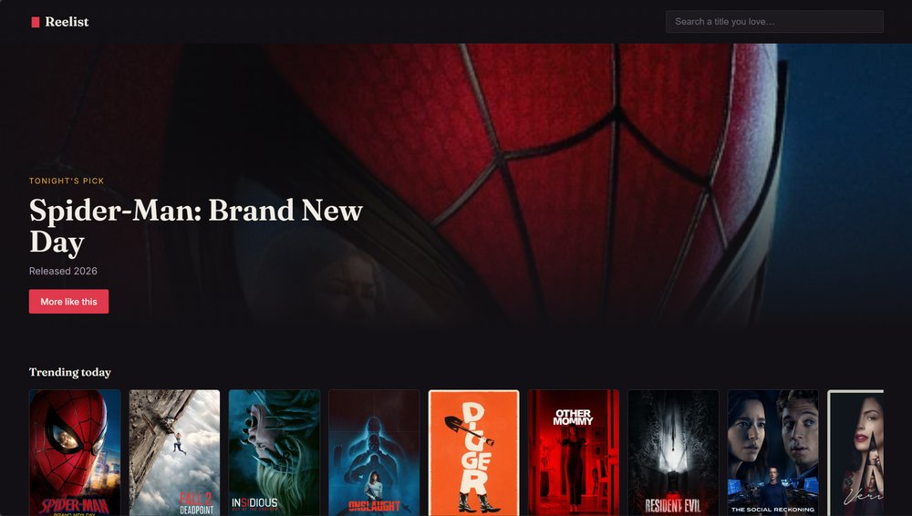
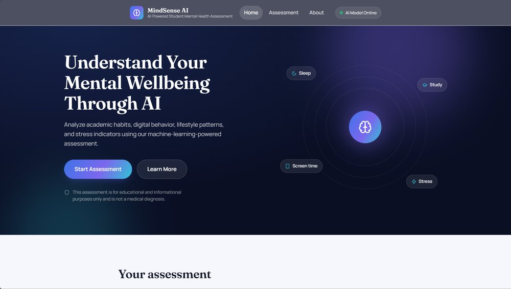

<!-- ═══════════════ HEADER ═══════════════ -->
<div align="center">

<picture>
  <source media="(prefers-color-scheme: dark)" srcset="logo-dark.png" />
  <source media="(prefers-color-scheme: light)" srcset="logo-light.png" />
  
</picture>
<br/>
<sub><b>M V N</b></sub>


<br/><br/>

<a href="https://my-portfolio-mvn4.vercel.app/"></a>
<a href="https://github.com/V-Madara"></a>


</div>

<br/>

<!-- ═══════════════ ABOUT ═══════════════ -->
## 🧑‍💻 About Me

<table>
<tr>
<td width="55%" valign="top">

I'm a developer who enjoys **building projects, experimenting with new technologies, and turning ideas into working software.**

Currently exploring **Python, Machine Learning, FastAPI, OpenCV, Java and Web Development.**

> ⚡ *Learn → Build → Break → Fix → Repeat.*

</td>
<td width="45%" valign="top">

```python
class Vishal:
    username = "V-Madara"
    location = "India"

    learning = [
        "Python", "Machine Learning",
        "FastAPI", "OpenCV", "Backend",
    ]

    goal = "Build useful things and get\
 better every day."
```

</td>
</tr>
</table>

<!-- ═══════════════ TECH STACK ═══════════════ -->
## 🛠️ Tech Stack

<div align="center">

**Languages**


**Frameworks & Libraries**


**Tools & Databases**


</div>

<!-- ═══════════════ WORKING ON ═══════════════ -->
## 🚀 What I'm Working On

| | Focus | |
|:-:|:--|:-:|
| 🐍 | Improving my **Python** skills | `ongoing` |
| 🤖 | Building **Machine Learning** projects | `ongoing` |
| ⚡ | Learning **FastAPI** & backend development | `ongoing` |
| 👁️ | Exploring **Computer Vision** with OpenCV | `ongoing` |
| 🌐 | Leveling up **web development** | `ongoing` |

<!-- ═══════════════ PROJECTS ═══════════════ -->
## 📌 Featured Projects

<div align="center">

<table>
<tr>
<td width="50%" align="center" valign="top">

<a href="https://reelists-1.onrender.com/"></a>

### 🎬 Reelist
A movie discovery app with trending titles, search, and "more like this" recommendations.

<a href="https://reelists-1.onrender.com/"></a>
<a href="https://github.com/V-Madara/Reelists"></a>

</td>
<td width="50%" align="center" valign="top">

<a href="https://mansik-health-1.onrender.com/"></a>

### 🧠 Mansik Health (MindSense AI)
An ML-powered student mental wellbeing assessment covering sleep, study, screen time and stress.

<a href="https://mansik-health-1.onrender.com/"></a>
<a href="https://github.com/V-Madara/Mansik-Health"></a>

</td>
</tr>
</table>

<sub>⏳ Demos run on a free tier, so the first load may take a few seconds. More on my <a href="https://github.com/V-Madara?tab=repositories">GitHub repositories</a>.</sub>

</div>

<!-- ═══════════════ STATS ═══════════════ -->
## 📊 GitHub Stats

<div align="center">


</div>

<!-- ═══════════════ SNAKE ═══════════════ -->
## 🐍 My Contributions

<div align="center">

<picture>
  <source media="(prefers-color-scheme: dark)" srcset="https://raw.githubusercontent.com/V-Madara/V-Madara/output/github-contribution-grid-snake-dark.svg" />
  <source media="(prefers-color-scheme: light)" srcset="https://raw.githubusercontent.com/V-Madara/V-Madara/output/github-contribution-grid-snake.svg" />
  
</picture>

</div>

<!-- ═══════════════ GOALS ═══════════════ -->
## 🎯 2026 Goals

```text
Keep Learning          [████████████████░░░░]  80%
Build Better Projects  [████████████░░░░░░░░]  60%
Master Python          [██████████░░░░░░░░░░]  50%
Machine Learning       [████████░░░░░░░░░░░░]  40%
Backend Development    [██████░░░░░░░░░░░░░░]  30%
Open Source            [████░░░░░░░░░░░░░░░░]  20%
```

<!-- ═══════════════ FOOTER ═══════════════ -->
<div align="center">

<br/>

> **"Don't just learn the technology. Build something with it."**

**Code. Learn. Build. Improve. Repeat. 🚀**

<br/>

<a href="https://my-portfolio-mvn4.vercel.app/"></a>
<a href="https://github.com/V-Madara"></a>

<sub>⭐ If you find something interesting here, feel free to star a repository!</sub>

<br/><br/>

<picture>
  <source media="(prefers-color-scheme: dark)" srcset="logo-dark.png" />
  <source media="(prefers-color-scheme: light)" srcset="logo-light.png" />
  
</picture>
<sub>&nbsp;<b>MVN</b> © 2026</sub>


</div>
